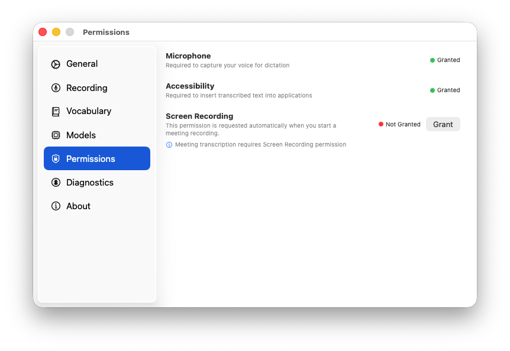
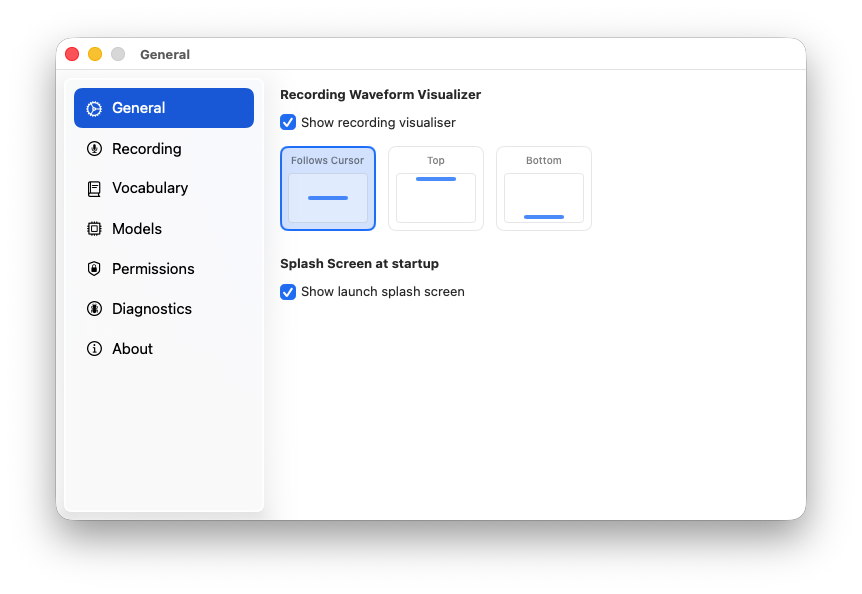
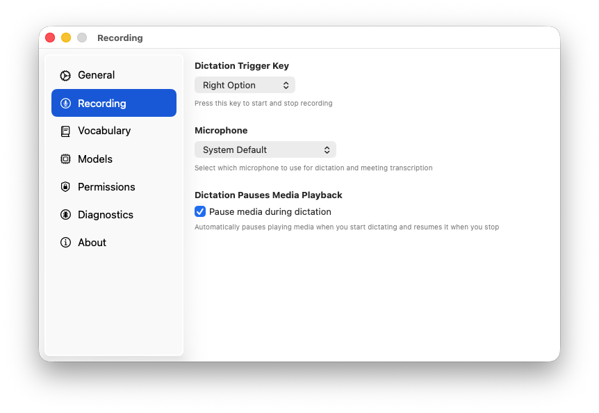
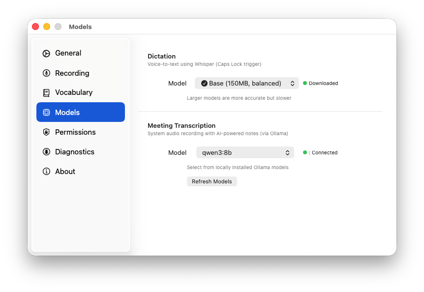
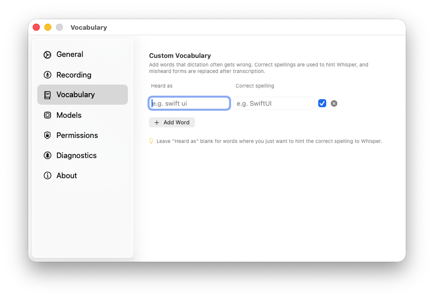

# Look Ma, No Hands 🙌🏾

Fast, local voice dictation and meeting transcription for macOS. Use custom keyboard shortcuts for instant dictation, or record video calls with AI-powered meeting notes.

<p align="center">
  

  <!---->
</p>

## ✨ Features

### Voice Dictation
- **Lightning Fast**: ~1 second transcription with Core ML acceleration (8-15x faster than competitors)
- **System-wide**: Works in any app, any text field
- **Fully Customizable Hotkeys**:
  - Caps Lock toggle (default, press once to start, again to stop)
  - Custom key combinations with real-time validation
  - Predefined alternatives (Right Option, Fn key)
  - Dynamic switching without app restart
  - System-reserved hotkey protection
- **Menu bar control**: Start/Stop Recording button
- **Smart formatting**: Automatic capitalization, punctuation, context-aware insertion, and cleanup
- **Auto-pause media**: Automatically pauses playing media (Apple Music, Spotify, Pocket Casts, etc.) when dictation starts and resumes when it stops. Toggle in Settings → General.

### Meeting Transcription 🆕
- **System audio capture**: Record video calls from Zoom, Meet, Teams, etc.
- **Continuous transcription**: Real-time speech-to-text during meetings
- **AI-powered notes**: Transform transcripts into structured, actionable documents using Ollama
- **Customizable prompts**: Add domain-specific jargon and customize output format
- **Structured output**: Automatically extracts:
  - Meeting overview (participants, date, purpose)
  - Key decisions made
  - Action items with owners and deadlines
  - Discussion summary
  - Open questions and follow-up items

### Core Features
- **100% Local**: Everything runs on your Mac, no cloud, no internet required
- **Privacy first**: Your voice never leaves your computer
- **Native macOS**:
  - Beautiful floating recording indicator with Siri-style animated multi-color border
  - Menu bar app with status icon that changes during recording
  - Settings window for permission and model management
  - Custom app icon
- **Core ML Optimized**: Utilizes Apple Neural Engine for maximum performance
- **Automatic model management**: Download and switch between Whisper models from the UI

## 🚀 Quick Start

<p align="center">
  
</p>

### 1. Install Dependencies

```bash
# Clone the repository
git clone https://github.com/qaid/lookmanohands.git
cd lookmanohands

# Build
swift build -c release
```

### 2. Download Whisper Model

**Easy Way**: Look Ma No Hands will prompt you to download a model on first launch. Choose "tiny" for best speed.

**Manual Way** (optional):
```bash
mkdir -p ~/.whisper/models
cd ~/.whisper/models

# Download tiny model (75 MB)
curl -L -O https://huggingface.co/ggerganov/whisper.cpp/resolve/main/ggml-tiny.bin

# Download Core ML acceleration (14 MB) - 5-10x faster!
curl -L -O https://huggingface.co/ggerganov/whisper.cpp/resolve/main/ggml-tiny-encoder.mlmodelc.zip
unzip ggml-tiny-encoder.mlmodelc.zip
rm ggml-tiny-encoder.mlmodelc.zip
```

You can also download and switch models from **Settings → Models** in the app.

### 3. Run

```bash
.build/release/LookMaNoHands
```

### 4. Optional: Install Ollama (for Meeting Transcription)

If you want AI-powered meeting notes:

```bash
# Install Ollama
brew install ollama

# Start Ollama service
ollama serve

# Download a model (in a new terminal)
ollama pull qwen2.5:3b
```

### 5. Grant Permissions

On first launch, grant:
1. **Microphone access**: To capture your voice for dictation
2. **Accessibility access**: To insert text and monitor Caps Lock key
3. **Screen recording** (optional): Required for system audio capture in meeting transcription

<p align="center">
  
</p>

**Note**: After granting accessibility permission, you may need to restart the app. Look Ma No Hands will prompt you to restart automatically.

## 🎯 Usage

### Voice Dictation (Hotkey)
1. Click any text field in any app
2. Press your configured hotkey to start recording (floating indicator appears with animated Siri-style border)
3. Speak naturally
4. Press the hotkey again to stop
5. Formatted text appears instantly with context-aware capitalization!

**Custom Hotkey Configuration**:
- Open **Settings → General → Recording Hotkey**
- Click the record button and press your desired key combination (1-2 modifiers + key)
- Real-time validation prevents system-reserved shortcuts
- Changes apply immediately—no restart needed

### Voice Dictation (Menu Bar)
1. Click the **Look Ma No Hands** menu bar icon
2. Select **Start Recording**
3. Speak naturally
4. Click the menu bar icon again and select **Stop Recording**

### Meeting Transcription 🆕
1. **Start a video call** (Zoom, Meet, Teams, etc.)
2. Click the menu bar icon → **Start Meeting Transcription**
3. Select audio source:
   - **System Audio**: Records what you hear from speakers (video call audio)
   - **Microphone**: Records your voice only
4. Click **Start Recording**
5. Speak during your meeting - live transcript appears in real-time
6. Click **Stop Recording** when done
7. Click **Generate Notes** to create structured meeting summary
8. **Customize prompt** (optional):
   - Add domain-specific jargon/terms
   - Edit the full prompt template
9. Review and copy/export the generated notes

### Settings Window
Access via menu bar → **Settings** to:
- **General Tab**:
  - Configure recording hotkey with real-time validation (Raycast-style hotkey recorder)
  - Recording indicator style preferences
  - Predefined hotkey shortcuts (Caps Lock, Right Option, Fn)
- **Models Tab**:
  - Download and switch Whisper models (tiny, base, small, medium)
  - Configure Ollama model for meeting notes
  - Check Ollama connection status
- **Permissions Tab**: Check and grant microphone, accessibility, and screen recording permissions
- **About Tab**: View app version and information

| General | Recording | Models | Vocabulary |
|:---:|:---:|:---:|:---:|
|  |  |  |  |

## ⚡ Performance

| Model | Size | Speed (16s audio) | Accuracy | Recommended |
|-------|------|-------------------|----------|-------------|
| **tiny** | 75 MB | **~1s** (Core ML) | Good for dictation | ✅ **Yes** |
| base | 142 MB | ~2-3s (Core ML) | Better accuracy | For longer transcriptions |
| small | 466 MB | ~5-7s (Core ML) | High accuracy | Complex terminology |

**With Core ML**: 8-15x faster on Apple Silicon!
**Without Core ML**: Falls back to CPU (still works, just slower)

See [PERFORMANCE.md](PERFORMANCE.md) for optimization details.

## 🛠️ Requirements

### macOS Compatibility

| macOS Version | Supported | Notes |
|---------------|-----------|-------|
| **macOS 15** (Sequoia) | ✅ Fully supported | |
| **macOS 14** (Sonoma) | ✅ Fully supported | Minimum required version |
| **macOS 13** (Ventura) | ❌ Not supported | Missing `@Observable` macro, new SwiftUI APIs |
| **macOS 12** (Monterey) and earlier | ❌ Not supported | Missing Swift concurrency runtime, ScreenCaptureKit |

**Why macOS 14?** The app uses the `@Observable` macro and SwiftUI's updated `onChange(of:)` API, both introduced in macOS 14 Sonoma.

### For Voice Dictation
- **macOS 14+** (Sonoma or later)
- **Apple Silicon** recommended (Intel Macs supported but slower)
- **~200 MB disk space** for tiny model + Core ML

### For Meeting Transcription
- **macOS 14+** (Sonoma or later)
- **Ollama** installed and running locally
- **Screen recording permission** (for system audio capture)
- **Additional disk space** for Ollama model (~2-4 GB)

## 📝 How It Works

### Voice Dictation
1. **Audio Capture**: AVFoundation records high-quality 16kHz mono audio from microphone
2. **Transcription**: Whisper.cpp with Core ML converts speech to text
3. **Formatting**: Rule-based system adds capitalization and punctuation
4. **Insertion**: Accessibility API pastes text directly into focused field

All processing happens on your Mac in under 1 second!

### Meeting Transcription
1. **System Audio Capture**: ScreenCaptureKit records audio from your video call app
2. **Continuous Transcription**: Audio is chunked and transcribed in real-time using Whisper
3. **Live Display**: Transcript appears as you speak during the meeting
4. **AI Processing**: When you click "Generate Notes", Ollama transforms the raw transcript into structured meeting notes
5. **Structured Output**: Returns formatted document with decisions, action items, discussion summary, etc.

## 🔧 Configuration

### Whisper Models
Change models in **Settings → Models → Dictation**:
- **tiny** (75 MB): Fastest, recommended for dictation
- **base** (142 MB): Better accuracy
- **small** (466 MB): High accuracy for complex terminology
- **medium** (1.5 GB): Highest accuracy

Models are downloaded automatically when you select them.

### Meeting Note Customization
In the Meeting Transcription window:
1. **Add Jargon/Terms**: Enter domain-specific terms (e.g., "LLM, RAG, embeddings") to improve accuracy
2. **Customize Prompt**: Expand "Advanced: Edit Full Prompt" to modify the output format
3. **Reset to Default**: Restore the default professional meeting assistant prompt

## 🐛 Troubleshooting

### Voice Dictation Issues

**Accessibility permission granted but still not working?**
- The app needs to restart after granting accessibility permission
- Look Ma No Hands will prompt you to restart automatically - click "Restart App Now"

**Core ML not loading?**
- Check console for `whisper_init_state: Core ML model loaded`
- Ensure `.mlmodelc` file is in `~/.whisper/models/`
- Requires Apple Silicon for best performance

**Text not inserting?**
- Some apps restrict accessibility—Look Ma No Hands falls back to clipboard
- Check Accessibility permissions in System Settings

**Caps Lock not working?**
- The app monitors Caps Lock presses (doesn't change actual Caps Lock state)
- Ensure Accessibility permission is granted

### Meeting Transcription Issues

**"Ollama: Not Running" in Settings?**
- Start Ollama: `ollama serve` in terminal
- Or install if not installed: `brew install ollama`
- Check connection in Settings → Models → Meeting Transcription → Check Connection

**No system audio being captured?**
- Grant Screen Recording permission in System Settings
- Restart the app after granting permission
- Make sure audio is playing through your speakers (not muted)

**Meeting notes generation fails?**
- Ensure Ollama is running: `ollama serve`
- Verify you have a model: `ollama list`
- Download a model if needed: `ollama pull qwen2.5:3b`
- Check Ollama model name matches in Settings → Models

## 📚 Project Structure

```
LookMaNoHands/
├── Sources/LookMaNoHands/
│   ├── App/              # Main app and menu bar
│   │   ├── LookMaNoHandsApp.swift    # App entry point
│   │   └── AppDelegate.swift         # Menu bar, coordination
│   ├── Services/         # Core functionality
│   │   ├── AudioRecorder.swift       # Microphone capture (dictation)
│   │   ├── SystemAudioRecorder.swift # System audio (meetings)
│   │   ├── WhisperService.swift      # Whisper.cpp + Core ML
│   │   ├── ContinuousTranscriber.swift # Real-time transcription
│   │   ├── MeetingAnalyzer.swift     # Ollama integration
│   │   ├── TextFormatter.swift       # Rule-based text cleanup
│   │   ├── TextInsertionService.swift # Accessibility API + context-aware formatting
│   │   ├── KeyboardMonitor.swift     # Custom hotkey detection and validation
│   │   └── MediaControlService.swift # Auto-pause/resume system media during dictation
│   ├── Views/            # SwiftUI + AppKit UI
│   │   ├── RecordingIndicator.swift  # Floating indicator with animated border
│   │   ├── SettingsView.swift        # Settings window
│   │   ├── MeetingView.swift         # Meeting transcription UI
│   │   └── HotkeyRecorderView.swift  # Raycast-style hotkey configuration
│   └── Models/           # State management
│       ├── Settings.swift            # User preferences
│       ├── Hotkey.swift              # Custom hotkey validation and management
│       └── TranscriptionState.swift  # App state
├── docs/                 # Documentation
│   ├── ARCHITECTURE.md
│   ├── MEETING_TRANSCRIPTION_PLAN.md
│   ├── ROADMAP.md
│   └── enable-custom-hotkeys.md     # Custom hotkey feature documentation
└── PERFORMANCE.md        # Optimization guide
```

## 🔒 Privacy & Security

Look Ma No Hands is built on a strict **local-only** architecture. Your voice, transcriptions, and meeting notes never leave your Mac.

| Guarantee | Detail |
|-----------|--------|
| **No cloud processing** | All speech-to-text and AI analysis runs on-device |
| **No telemetry or analytics** | Zero tracking, zero data collection |
| **No accounts or sign-in** | Nothing to create, nothing to leak |
| **No internet required** | After the initial model download, the app works fully offline |
| **Open source** | Every line of code is auditable |

The only outbound network requests are model downloads (Hugging Face) and update checks (GitHub), both user-initiated.

### Security Hardening

A comprehensive security audit was completed and all critical, medium, and low-priority findings have been addressed:

- **Verified model downloads** — SHA-256 checksums and size validation before any Whisper model is used
- **Verified app updates** — cryptographic signature verification before installation
- **Safe archive extraction** — path-traversal and zip-bomb protection
- **Pinned dependencies** — exact Git revision pinning with CI integrity checks
- **Automated scanning** — Dependabot monitors dependencies; CI verifies `Package.resolved` on every PR
- **Release provenance** — every release includes SHA-256 checksums and a Software Bill of Materials (SBOM)
- **Privacy-safe crash reports** — transcription content is fully redacted with no metadata leakage

For the full audit summary, resolved findings, and current security posture, see **[docs/SECURITY.md](docs/SECURITY.md)**.

## 🚧 Known Limitations

### Voice Dictation
- Caps Lock monitoring requires Accessibility permission
- Some sandboxed apps may not allow direct text insertion
- Best accuracy with clear audio in quiet environments
- English-only (Whisper supports other languages, but not tested)

### Meeting Transcription
- System audio capture requires Screen Recording permission
- System audio capture requires macOS 14+ (Sonoma or later)
- Speaker identification not yet implemented (all text appears as one speaker)
- Ollama must be running locally for AI-powered note generation
- Meeting notes are not automatically saved (copy/paste to save)

## 📖 Advanced Usage

### Using Different Whisper Models

**Easy Way**: Use Settings → Models → Dictation to download and switch models with one click.

**Manual Way**: Download models from [Hugging Face](https://huggingface.co/ggerganov/whisper.cpp/tree/main):

```bash
cd ~/.whisper/models
curl -L -O https://huggingface.co/ggerganov/whisper.cpp/resolve/main/ggml-base.bin
curl -L -O https://huggingface.co/ggerganov/whisper.cpp/resolve/main/ggml-base-encoder.mlmodelc.zip
unzip ggml-base-encoder.mlmodelc.zip
```

### Customizing Meeting Note Format

Edit the default prompt in the Meeting Transcription window:
1. Click "Customize Prompt" button
2. Expand "Advanced: Edit Full Prompt"
3. Modify the template to match your needs
4. Changes are saved automatically

Example customizations:
- Add specific sections (e.g., "Risks Identified", "Budget Discussion")
- Change the action items table format
- Adjust the level of detail in summaries
- Add company-specific terminology

### Building for Release

```bash
swift build -c release
# Or use the deployment script:
./deploy.sh
```

## 👥 Contributing

Contributions welcome! Please read [docs/ARCHITECTURE.md](docs/ARCHITECTURE.md) first.

## 📄 License

MIT License - see [LICENSE](LICENSE) file.

## 🙏🏾 Acknowledgments

- [whisper.cpp](https://github.com/ggerganov/whisper.cpp) - Fast Whisper inference
- [SwiftWhisper](https://github.com/exPHAT/SwiftWhisper) - Swift bindings
- [Ollama](https://ollama.ai) - Local LLM infrastructure
- Inspired by macOS built-in dictation, but faster and fully local

---

**Made with ❤️ for productive macOS users who value privacy and speed.**
